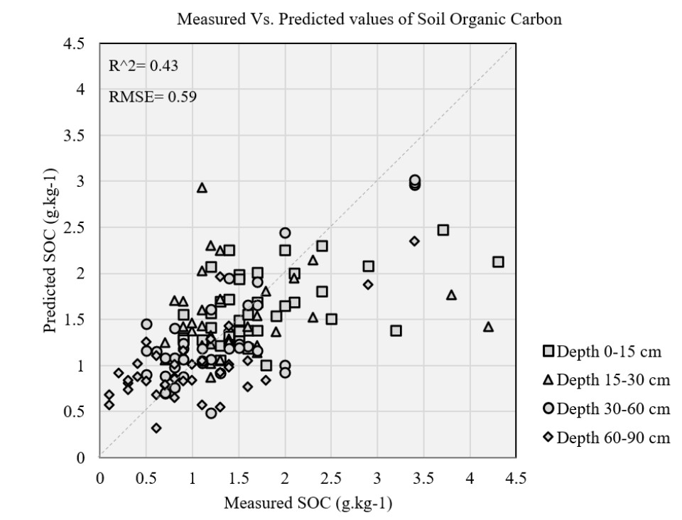

# VIS-NIR Spectroscopy & LASSO Regression for Soil Organic Carbon Prediction

Feature selection and model calibration for predicting Soil Organic Carbon (SOC) from VIS-NIR spectroscopy data, using LASSO regression and engineered spectral band-ratio indices. This repository presents a portion of the analysis developed for a Master's thesis.

## Background

This work was conducted at the **Leibniz Institute for Agricultural Engineering and Bioeconomy (ATB), Potsdam**, as part of a Master's thesis predicting several soil properties — Soil Organic Carbon (SOC), Phosphorus, Magnesium, Potassium, Clay, and Sand content — from VIS-NIR spectrometer measurements collected at a test field in eastern Germany.

The main challenge: VIS-NIR spectra contain hundreds of highly correlated wavelength bands, and the dataset was limited to 151 soil samples across four depths (0–15, 15–30, 30–60, 60–90 cm). This required careful feature selection to avoid overfitting while retaining predictive power — SOC is widely considered one of the more difficult soil properties to predict accurately from spectral data.

This repository focuses specifically on the SOC prediction pipeline, which achieved the best performance among the properties studied.

## Method

1. **Data split** — 12 held-out test samples per depth, remaining samples used for training
2. **Preprocessing** — feature scaling via `StandardScaler`
3. **LASSO feature selection** — grid search over regularization strength (alpha) to identify the most informative wavelengths; coefficients used to rank feature importance
4. **Spectral index generation** — from the top 30 LASSO-selected wavelengths, generated engineered dual-band (NDI, SRI) and triple-band (TBI) ratio indices, to capture non-linear relationships between wavelengths and SOC
5. **Model calibration** — nested cross-validation (10-fold outer/inner) with a LASSO pipeline, chosen due to the small sample size, to obtain unbiased performance estimates without a separate holdout validation set
6. **Visualization** — predicted vs. observed SOC across soil depth

## Results

| Stage | RMSE | R² |
|---|---|---|
| LASSO, all wavelengths | 0.433 | — |
| LASSO, top 30 selected wavelengths | 0.499 | — |
| Final model (triple-band index, nested CV) | 0.589 | 0.426 |

Final model additional metrics: MAE ≈ 0.44, RPIQ ≈ 0.58.

The triple-band index derived from LASSO-selected wavelengths outperformed the raw wavelength-based LASSO model, suggesting that band-ratio transformations capture additional structure relevant to SOC prediction beyond individual wavelength intensities.

Predictions track the 1:1 line reasonably well in the low-to-mid SOC range (0–2 g/kg), where the majority of samples fall, with a sensible depth gradient — deeper soil layers (60–90 cm) cluster at lower SOC values, consistent with the known concentration of organic carbon near the surface. Predictions become less reliable at the higher end of the SOC range (above ~3 g/kg), where fewer training samples were available — a common limitation in spectroscopy calibration with small, field-scale datasets.

## Tools

- Python, pandas, NumPy, scikit-learn (Lasso, Pipeline, GridSearchCV, nested cross-validation), Matplotlib

## Notes

This repository contains a representative excerpt of a larger thesis pipeline (which covered 7 soil properties across 4 depths, ~126 generated datasets in total). The raw spectroscopy dataset and some intermediate output files referenced in the notebook are not included here, as they are part of the broader unpublished thesis dataset.
